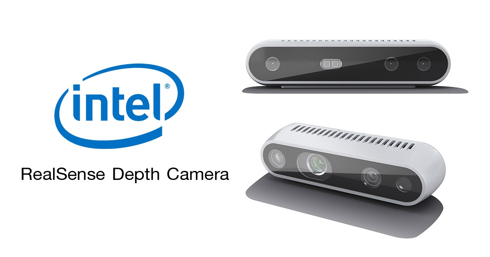

<p align="center"></p>
<p align="center"> Cross-platform .NET library for digital signal processing </p>  

# Intel RealSense Depth Camera
**UMapx.Video.RealSense** is a sub-library for interacting with Intel RealSense Depth cameras.
<p align="center"></p>  

# Installation
Install Intel RealSense Viewer from [realses](https://github.com/IntelRealSense/librealsense/releases) and upload one of the json available [presets](https://github.com/IntelRealSense/librealsense/wiki/D400-Series-Visual-Presets) in application. Install **UMapx.Video.RealSense** to your project using [NuGet](https://www.nuget.org/packages/UMapx.Video.RealSense/) package manager.

C# interface
```c#
using UMapx.Video.RealSense;
```
To get started with UMapx.Video.RealSense try simple [example](example).

# License
MIT
