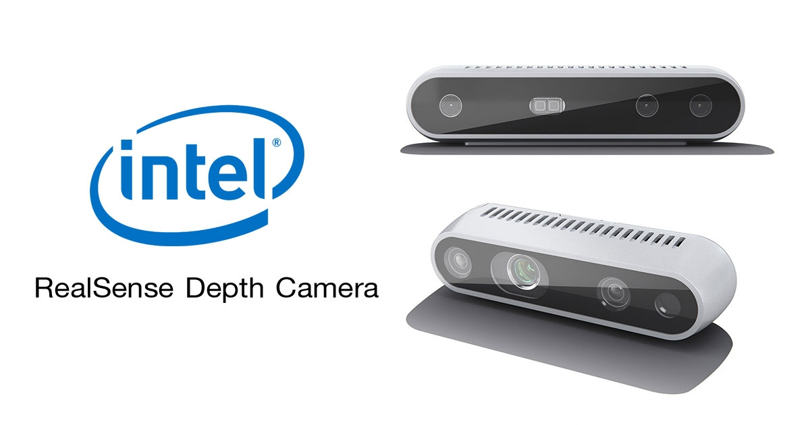

<p align="center"></p>
<p align="center"> UMapx sub-library for interacting with Intel RealSense Depth cameras </p>  

# Installation
This package requires Windows x64. Its native SDK dependency contains a Windows x64 DLL.

<p align="center"></p>  

Install Intel RealSense Viewer from [realses](https://github.com/IntelRealSense/librealsense/releases) and upload one of the json available [presets](https://github.com/IntelRealSense/librealsense/wiki/D400-Series-Visual-Presets) in application. Install **UMapx.Video.RealSense** to your project using [NuGet](https://www.nuget.org/packages/UMapx.Video.RealSense/) package manager.

C# interface
```c#
using UMapx.Video.RealSense;
```
To get started with **UMapx.Video.RealSense** try simple [example](examples).

# Example

The WPF example runs on Windows x64 and targets .NET 8, like the UMapx.Video.Windows
example. Install the .NET 8 SDK to build it, or the .NET 8 Desktop Runtime to run a
framework-dependent build. The native RealSense SDK is supplied by the NuGet dependency.

```sh
dotnet run --project examples/UMapx.Video.RealSense.Example.csproj -c Release
```

The window displays camera discovery and capture errors, including when no camera is
connected. Connect the camera and click **Reconnect** to retry. Closing the window waits
for capture cleanup without blocking the UI. The preview retains only the latest frames.

# Capture lifecycle

`Start()` launches background capture. Camera startup errors, frame timeouts and exceptions
from `NewFrame` or `NewDepth` handlers stop that run and raise `VideoSourceError`, followed
by `PlayingFinished` with `ReasonToFinishPlaying.VideoSourceError`.

`SignalToStop()` requests shutdown without waiting. Call `WaitForStop()` afterwards to wait
for frame handlers, completion notifications and cleanup before restarting. `IsRunning`
remains true until the worker exits; `Start()` has no effect while that worker is alive.
The obsolete `Stop()` method requests shutdown and waits for that run to finish.

`Dispose()` stops capture before releasing SDK resources and prevents further starts.
When `Stop()`, `WaitForStop()` or `Dispose()` is called from this source's own event handler,
it does not wait for itself; cleanup completes after the handler returns. Clone a color
frame if it must remain available after its `NewFrame` handler returns.

# Build and test

Run `dotnet test UMapx.Video.RealSense.sln -c Release` on Windows x64 with the .NET 8
SDK, or a newer SDK with the .NET 8 Desktop Runtime installed. Tests cover capture lifecycle,
WPF preview and shutdown, and the native SDK with a software RealSense device. They check
color/depth conversion, row padding, alignment and capture restart without a physical camera.
Actual streaming and USB disconnect behavior still require a physical RealSense device.

# License
MIT
